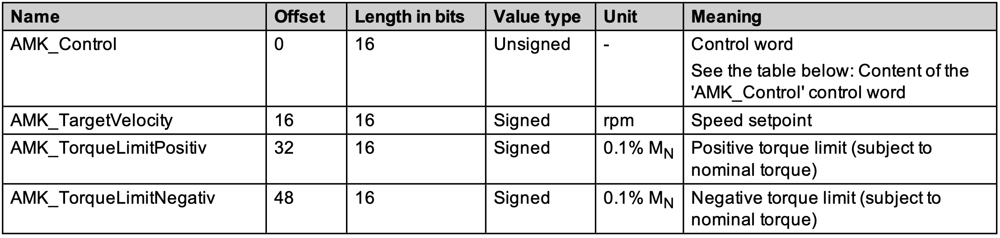
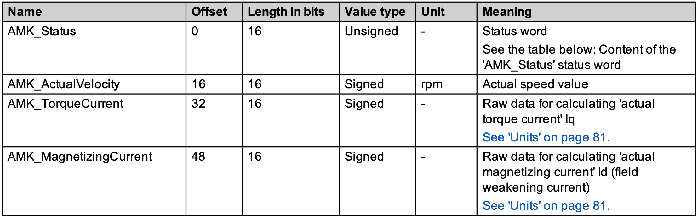
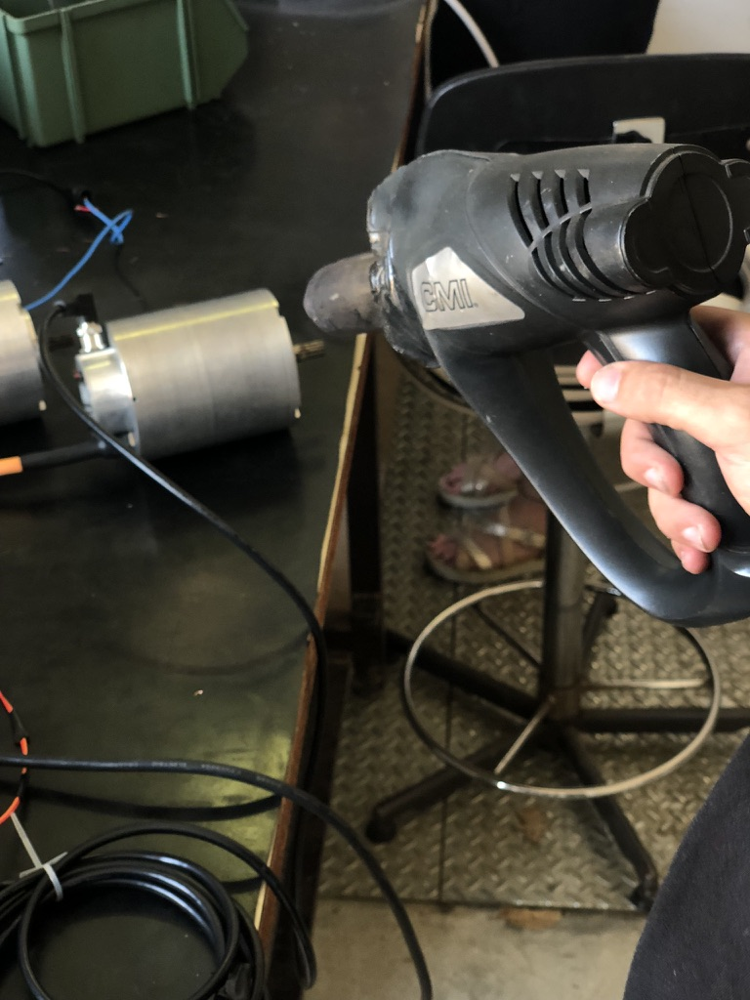

# Implementazione di un CAN bus per ricezione ed invio dati a due inverter (e motori) per una vettura di Formula SAE

## Indice

1. [Introduzione](#introduzione)
2. [Cos'è il CAN Bus](#cosè-il-can-bus)
3. [Specifiche di progetto](#specifiche-di-progetto)
4. [Hardware Utilizzato](#hardware-utilizzato)
5. [Software Utilizzato](#software-utilizzato)
6. [Installazione e Configurazione](#installazione-e-configurazione)
7. [Spiegazione del Codice](#spiegazione-del-codice)
8. [Risultati dei test](#risultati-dei-test)
9. [Risorse e Riferimenti](#risorse-e-riferimenti)

## Introduzione
Il progetto consiste nello sviluppare la comunicazione tra un microcontrollore e un inverter tramite protocollo CAN nell'ambito delle gare automobilistiche, in particolare per una vettura di Formula SAE.

## Cos'è il CAN Bus
Il CAN bus (Controller Area Network) è un protocollo di comunicazione molto robusto utilizzato principalmente nei veicoli e nei sistemi industriali per permettere ai vari dispositivi di comunicare tra loro senza un entità centrale.

#### Vantaggi del CAN bus
Il CAN bus ha diversi vantaggi:
- **Robustezza** poichè è stato sviluppato proprio per lavorare in ambienti difficili. 
Infatti è molto resistente ai disturbi elettromagnetici e garantisce una comunicazione più affidabile rispetto ad altri sistemi. 
In particolare vengono utilizzati 2 fili per la trasmissione dei dati con polarità opposta e quando si presenta un disturbo elettromagnetico si presenta su entrambi i fili: a questo punto il segnale ricevuto sarà la differenza tra i due segnali ed i rispettivi disturbi ma essendo i disturbi uguali il disturbo comune verrà annullato.
A volte i 2 fili vengono anche twistati garantendo un distirbo comune minore.
Inoltre in molti dei settori in cui viene utilizzato il CAN viene implementato anche lo shielding che permette assieme ad un buon grounding, di eliminare già in avvio i disturbi che arrivano dall'esterno.
Un'altro fattore di robustezza è il rilevamento degli errori che viene implementato. Il CRC (Cyclic Redundancy Check) è il principale meccanismo utilizzato in cui il trasmettitore, basandosi sul contenuto del pacchetto, genera un valore CRC che viene inserito nel pacchetto. Il ricevitore ha il compito di generare anch'esso un CRC in base al contenuto del pacchetto ricevuto e lo confronta con quello appena inviato. Se i valori del CRC non corrispondono allora viene rilevato un errore. Vengono implementati anche altri meccanismi come il Frame check in cui vengono controllati i bit di inizio e di fine frame, il Byte stuffing in cui il trasmettitore invia un bit opposto dopo 5 bit uguali consecutivi, il ricevitore lo ricnosce e lo rimnuove dal contenuto: se il numero di bit finale non corrisponde a quello standard allora viene rilevato un errore.
- **arbitraggio distribuito** evitando così di avere problemi nel caso in cui un solo dispositivo fallisca.
- **velocità elevate** fino a 1 Mbps che è molto elevato rispetto alle applicazioni automobilistiche o industriali. Basti pensare all'applicazione utilizzata in questo progetto in cui viene inviato un pacchetto con un contenuto da 8 byte (64 bit). Contando che un frame CAN utilizza altri bit per il rilevamento di errori, arbitraggio ed altri motivi si potrebbe concludere che un pacchetto abbia dimensione pari a 100 bit. Di conseguenza per trasmettere 100 bit il sistema impiegherà 0,0001 s = 100 µs.

#### CAN Frame
Il frame CAN è il seguente


#### Motivazioni sull'utilizzo nel progetto
La motivazione principale per l'utilizzo del CAN bus nel progetto riguarda la struttura di rete presente nel veicolo. Il veicolo include numerosi dispositivi, come l'inverter, il pacco batteria, l'IMU (Unità di Misura Inerziale) e varie schede di comunicazione, che operano utilizzando il CAN bus. Utilizzare un unico bus di comunicazione per tutti questi dispositivi offre diversi vantaggi tra cui, dal mio punto di vista il più importante ovvero la semplicità del software utilizzato. Infatti utilizzare un unico CAN bus permette di definire librerie comuni a tutti i dispositivi che contengono ID dei pacchetti, vari messaggi di errore e nel caso di hardware simili anche operazioni di invio e ricezione standard.

## Specifiche di progetto
Il progetto deve rispettare delle specifiche:
- invio di 1 pacchetto ad ogni inverter circa ogni 50 ms ciclicamente. Il pacchetto contiene i setpoint di velocità di rotazione del motore e limitazioni di coppia (e alcuni bit di controllo)…
- ricezione ciclica di 2 pacchetti per ogni inverter ogni 50 ms che forniscono dati su Temperature motori, inverter, correnti, info su eventuali errori e velocità di rotazione dei motori.
- gestire la conversione da in invio (little endian -> big endian) e in ricezione (big endian -> little endian) dei vari pacchetti

## Hardware utilizzato
Le componenti hardware coinvolte nel progetto sono:
- AMK Formula SAE Racing kit (x2 inverter, x2 motori)
- Adafruit Feather M4 CAN
- cavi di collegamento vari e alimentatore 24V (solo parte logica)

## Software utilizzato
Il software utilizzato comprende:
- Linguaggio C++.
- Librerie CAN esterne: ([arduino CAN](https://github.com/sandeepmistry/arduino-CAN), [Adafruit CAN library](https://github.com/adafruit/Adafruit_CAN)).
- Libreria di progetto con specifiche su CAN e inverter AMK.
- PlatformIO come IDE per lo sviluppo embedded. Fornisce strumenti per il debug, l'upload e il riconoscimento della scheda utilizzata.
- Software di configurazione degli inverter fornito da AMK: Aipex Pro.

## Installazione e Configurazione
I passi per la configurazione necessari sono:
#### 1. collegamento degli inverter
Il primo step è quello di effettuare 
- il collegamento degli inverter ai motori (cavo encoder) e 
- il collegamento in EtherCAT ai vari inverter. Viene collegato il PC al primo degli inverter tramite cavo Ethernet. Ogni inverter è collegato direttamente tramite un cavo Ethernet al dispositivo successivo. Questi cavi Ethernet trasportano i dati in tempo reale tra i dispositivi EtherCAT.
- un'altro collegamento necessario al funzionamento del tutto è quello di alimentazione, nel nostro caso è necessario anche solo l'alimentazione 24V che permette il funzionamento della componente logica.
#### 2. configurazione degli inverter
E' possibile tramite AMK Aipex Pro configurare tutti i parametri relativi agli inverter.
E' possibile utilizzare 2 configurazioni CAN differenti:
- **Free configuration** in cui si ha il massimo livello di personalizzazione dei pacchetti CAN (non utilizzata in questo progetto)
- **Fixed configuration** in cui si utilizzano dei pacchetti CAN già definiti (2 in ricezione e 1 in invio) nel seguente modo e che vedremo in dettagli più avanti:

In particolare, ogni inverter è identificato da un NODE_ADDRESS che poi andrà a costituire parte dei vari CAN Identifier ovvero gli ID dei pacchetti. E' importante settare i NODE_ADDRESS come specificato da AMK (o in altro modo ma evitando conflitti tra ID):

all'interno del parametro User list 3 (ID34091):

L'output rate utilizzato è 50 ms il che significa che ogni inverter, ogni 50 ms costruisce un pacchetto e lo invia sul CAN bus con gli ID specificati da Actual Values 1 e 2. Il transmission rate è impostato al default (500 kBit/s)

Gli altri parametri dell'inverter che non riguardano il CAN possono essere impostati in base alle specifiche del proprio progetto.
#### 3. collegamento del can bus alla scheda
Nel caso in cui l'inverter è pronto (status LED green) si può procedere al collegamento della scheda all'inverter tramite (abbiamo utilizzato dei jumper almeno per la fase di testing).

In foto:
- il nero è il GND collegato al verde
- giallo collegato al bianco è CAN_HIGH
- giallo collegato al marrone è CAN_LOW

Inoltre la scheda deve essere alimentata, nel nostro caso l'alimentazione viene data dal pc (cavo usb-c) da cui viene effettuato l'upload del codice.
#### 4. Installazione di PlatformIO IDE e upload del codice
Una volte scritto lo script PlatformIO IDE fornisce funzionalità di build e di upload sulla scheda. Se, come nel nostro caso per scopi di testing ci si collega al seriale si possono anche visualizzare i dati inviati e ricevuti (i pacchetti CAN).

Prima di visulizzare i risultati dei test analizziamo il codice.

## Spiegazione del codice
Il codice utilizza due librerie. In particolare la libreria CAN.h è stata modificata per supportare le librerie fornite da Adafruit sul CAN bus:
```
// Copyright (c) Sandeep Mistry. All rights reserved.
// Licensed under the MIT license. See LICENSE file in the project root for full license information.

#ifndef CAN_H
#define CAN_H

#if defined(ADAFRUIT_FEATHER_M4_CAN)
#include "CANSAME5x.h"
#elif defined(ARDUINO_ARCH_ESP32)
#include "ESP32SJA1000.h"
#else
#include "MCP2515.h"
#endif

#endif
```

in questo modo la libreria CAN.h reindirizza alla libreria CANSAME5x.h fornita da Adafruit.
Per quanto riguarda il main, tralasciando le stampe in seriale, la struttura è molto semplice.

```
// main.cpp
#include <Arduino.h>
#include <CANSAME5x.h>
#include "AMK.h"

CANSAME5x CAN;
amk_actual_values actual_values;
amk_setpoint_1 setpoints;
uint8_t tx_packet[8];

void set_values();

void setup()
{
    init_device();

    CAN.onReceive(receive_message);
}

void loop()
{
    set_values(); // set dei setpoint

    build_message(&setpoints, tx_packet);
    if (send_message(tx_packet, AMK_INVERTER_1_SETPOINTS_1) &&
        send_message(tx_packet, AMK_INVERTER_2_SETPOINTS_1))
    {
        Serial.printf("Done Sending!\n");
        delay(40);
    }
    else
    {
        Serial.printf("Error occurred while  sending!\n");
    }
}

...
```

Troviamo principalmente le funzionalità specificate all'inizio:
- ricezione tramite callback (ovvero ogni qualvolta arriva un messaggio CAN viene richiamata la funzione *receive_message*);
- invio all'interno del loop in cui vengono specificati il pacchetto da trasmettere e l'indirizzo del pacchetto;

le altre funzioni richiamate sono:
- *init_device()* che va ad inizializzare la scheda e le varie funzionalità (Seriale e CAN bus);
```
void init_device()
{
    Serial.begin(115200);
    
    pinMode(PIN_CAN_STANDBY, OUTPUT);
    digitalWrite(PIN_CAN_STANDBY, false); // turn off STANDBY
    pinMode(PIN_CAN_BOOSTEN, OUTPUT);
    digitalWrite(PIN_CAN_BOOSTEN, true); // turn on booster

    // avvia il can bus a 500kbps
    if (!CAN.begin(500E3))
    {
        Serial.printf("Starting CAN failed!\n");
        // se la comunicazione non avviene correttamente il led lampeggia
        while (1)
        {
            digitalWrite(LED_BUILTIN, HIGH);
            delay(200);
            digitalWrite(LED_BUILTIN, LOW);
            delay(200);
        }
    }
}
```
- *build_message()* che effettua una semplice conversione da big endian a little endian.
```
void build_message(amk_setpoint_1 *setpoint, uint8_t *buffer)
{
    buffer[0] = setpoint->amk_control & 0xFF;
    buffer[1] = (setpoint->amk_control >> 8) & 0xFF;
    buffer[2] = setpoint->amk_target_velocity & 0xFF;
    buffer[3] = (setpoint->amk_target_velocity >> 8) & 0xFF;
    buffer[4] = setpoint->amk_torque_limit_positive & 0xFF;
    buffer[5] = (setpoint->amk_torque_limit_positive >> 8) & 0xFF;
    buffer[6] = setpoint->amk_torque_limit_negative & 0xFF;
    buffer[7] = (setpoint->amk_torque_limit_negative >> 8) & 0xFF;
}
```
Il riferimento alla variabile setpoint è un riferimento alla seguente struct:
```
typedef struct
{
    uint16_t amk_control;
    int16_t amk_target_velocity;
    int16_t amk_torque_limit_positive;
    int16_t amk_torque_limit_negative;
} amk_setpoint_1;
```
che è stato costruito in base a ciò che si trova sul manuale:

Mentre il buffer si riferisce ad un vettore da 8 Byte ed è l'effettivo pacchetto che verrà poi inviato. Ho scelto di creare un buffer perchè è più semplice da gestire.

- *set_values()* che va a settare il messaggio da inviare. In questa prima versione dello script il messaggio è sempre lo stesso e questa funzione in futuro dovrà dipendere da input esterni;

Analizziamo ora le funzioni di ricezione ed invio
#### *receive_message()*
Prima di vedere la funzione è fondamentale capire a cosa ci si riferisce con amk_actual_values e amk_actual_values_1 o 2. Infatti i messaggi in ricezione definiti da AMK sono 2:

descritto nello struct 
```
typedef struct
{
    uint16_t amk_status;
    int16_t amk_actual_velocity;
    int16_t torque_current;
    int16_t magnetizing_current;
} amk_actual_values_1;
```
mentre

descritto nello struct
```
typedef struct
{
    int16_t amk_temp_motor;
    int16_t amk_temp_inverter;
    uint16_t amk_error_info;
    int16_t amk_temp_igbt;
} amk_actual_values_2;
```
Inoltre, sapendo che la funzione di ricezione non viene chiamata più volte contemporaneamente perchè i pacchetti in ricezione vengono messi in attesa, ho definito una union che memorizza o un elemento di tipo amk_actual_values_1 o 2.
```
typedef union
{
    amk_actual_values_1 actual_values_1;
    amk_actual_values_2 actual_values_2;
} amk_actual_values;
```
Questo è il tipo che verrà poi effettivamente utilizzato nel programma. In questo modo si va a ottimizzare di poco l'uso della memoria.
Quindi la funzione di ricezione:
```
void receive_message(int packetSize)
{
    // viene estratto l'ID del pacchetto
    long packet_ID = CAN.packetId();
    Serial.printf("Received CAN packet from...0x%X\n", packet_ID);

    // tramite l'ID del pacchetto viene definito anche se esso è di tipo 1 o di tipo 2
    bool is_actual_values_1 = (packet_ID == AMK_INVERTER_1_ACTUAL_VALUES_1 || packet_ID == AMK_INVERTER_2_ACTUAL_VALUES_1);

    if (CAN.available() >= packetSize)
    {
        // contestualmente alla lettura viene fatta anche la conversione
        // ogni volta che viene effettuata la CAN.read vengono restituiti 8 bit (1 Byte)
        // caso di pacchetto di tipo 1
        if (is_actual_values_1)
        {
            actual_values.actual_values_1.amk_status = CAN.read() | (CAN.read() << 8);
            actual_values.actual_values_1.amk_actual_velocity = CAN.read() | (CAN.read() << 8);
            actual_values.actual_values_1.torque_current = CAN.read() | (CAN.read() << 8);
            actual_values.actual_values_1.magnetizing_current = CAN.read() | (CAN.read() << 8);
        }
        // caso di pacchetto di tipo 2
        else
        {
            actual_values.actual_values_2.amk_temp_motor = CAN.read() | (CAN.read() << 8);
            actual_values.actual_values_2.amk_temp_inverter = CAN.read() | (CAN.read() << 8);
            actual_values.actual_values_2.amk_error_info = CAN.read() | (CAN.read() << 8);
            actual_values.actual_values_2.amk_temp_igbt = CAN.read() | (CAN.read() << 8);
        }
    }
    // se non viene riconosciuto l'id del pacchetto allora non è possibile effettuare la lettura
    else
    {
        Serial.println("Invalid packet size");
        return;
    }

    // effettua la semplice stampa nel monitor seriale dei valori
    process_actual_values(&actual_values, is_actual_values_1);
}
```
#### *send_message(uint8_t\* message, const int address)*
La funzione restituisce un valore booleano che corrisponde alla corretta riuscita dell'invio:
- restituisce *true* nel caso di corretto invio;
- restituisce *false* nel caso in cui ci siano interruzioni durante l'invio (ad es. vengono inviati meno bit)
```
bool send_message(uint8_t *message, const int address)
{
    Serial.printf("Sending packet to ...0x%X\n", address);
    CAN.beginPacket(address);
    size_t bytesSent = CAN.write(message, 8);
    CAN.endPacket();
    // restituisce true solo se vengono inviati 8 Byte
    return (bytesSent == 8);
}
```
## Risultati dei test
Per quanto riguarda i test che sono stati effettuati sono principalmente 2:
- test sulla corretta ricezione del valore di velocità presente negli actual_values_1
- test sulla corretta ricezione del valore di temperatura dei motori presente negli actual_values_2

#### 1. test sulla velocità del motore
Non disponendo di alimentazione HV non è stato possibile alimentare correttamente i motori. Per questo è stato utilizzato un avvitatore per far girare il motore e quindi effettuare delle letture tramite l'encoder.

<video width="320" height="240" controls>
  <source src="img/velocita.mp4" type="video/mp4">
  Your browser does not support the video tag.
</video>

In questo caso sul file di log è possibile notare come siano registrati diversi valori:
- all'inizio si attesta sui 160/170 rpm
- dopodichè si stabilizza a 0 rpm (il motore non viene più ruotato)

```
Done Sending!
Received CAN packet from...0x283
AMK_Status: 53504
AMK_ActualVelocity: 168
AMK_TorqueCurrent: -0.052246
AMK_MagnetCurrent: 0.006531
Received CAN packet from...0x285
AMK_TempMotor: 34.000000
AMK_TempInverter: 30.600000
AMK_ErrorInfo: 0
AMK_TempIGBT: 30.600000
Sending packet to ...0x184
Sending packet to ...0x185
Done Sending!
Received CAN packet from...0x283
AMK_Status: 53504
AMK_ActualVelocity: 170
AMK_TorqueCurrent: 0.071838
AMK_MagnetCurrent: 0.019592
Received CAN packet from...0x285
AMK_TempMotor: 34.000000
AMK_TempInverter: 30.600000
AMK_ErrorInfo: 0
AMK_TempIGBT: 30.600000
Sending packet to ...0x184
Sending packet to ...0x185
Done Sending!
```

Verso fine file (le ultime letture) sono negative e questo è dato molto probabilmente da piccole vibrazioni del motore.

### 2. test sulla temperatura del motore

Anche in questo caso è stato utilizzato un phon da officina per scaldare il motore. Nel test precedente abbiamo visto come la temperatura del motore (che corrispondeva alla temperatura ambiente) era attorno ai 34 gradi. Con il phon si è riusciti a portare la temperatura a circa 40 gradi nella prima lettura e 45 nella seconda.



Il log è il seguente:

```
Received CAN packet from...0x283
AMK_Status: 53504
AMK_ActualVelocity: 0
AMK_TorqueCurrent: -0.026123
AMK_MagnetCurrent: -0.045715
Received CAN packet from...0x285
AMK_TempMotor: 40.500000
AMK_TempInverter: 31.400000
AMK_ErrorInfo: 0
AMK_TempIGBT: 31.400000
Sending packet to ...0x184
Sending packet to ...0x185
Done Sending!
Received CAN packet from...0x283
AMK_Status: 53504
AMK_ActualVelocity: 0
AMK_TorqueCurrent: 0.019592
AMK_MagnetCurrent: -0.078369
Received CAN packet from...0x285
AMK_TempMotor: 40.500000
AMK_TempInverter: 31.400000
AMK_ErrorInfo: 0
AMK_TempIGBT: 31.400000
```

nella seconda lettura:
```
Received CAN packet from...0x283
AMK_Status: 53504
AMK_ActualVelocity: 0
AMK_TorqueCurrent: 0.006531
AMK_MagnetCurrent: -0.026123
Received CAN packet from...0x285
AMK_TempMotor: 45.200000
AMK_TempInverter: 31.600000
AMK_ErrorInfo: 0
AMK_TempIGBT: 31.600000
Sending packet to ...0x184
Sending packet to ...0x185
Done Sending!
Received CAN packet from...0x283
AMK_Status: 53504
AMK_ActualVelocity: 0
AMK_TorqueCurrent: -0.019592
AMK_MagnetCurrent: 0.000000
Received CAN packet from...0x285
AMK_TempMotor: 45.200000
AMK_TempInverter: 31.500000
AMK_ErrorInfo: 0
AMK_TempIGBT: 31.500000
```
